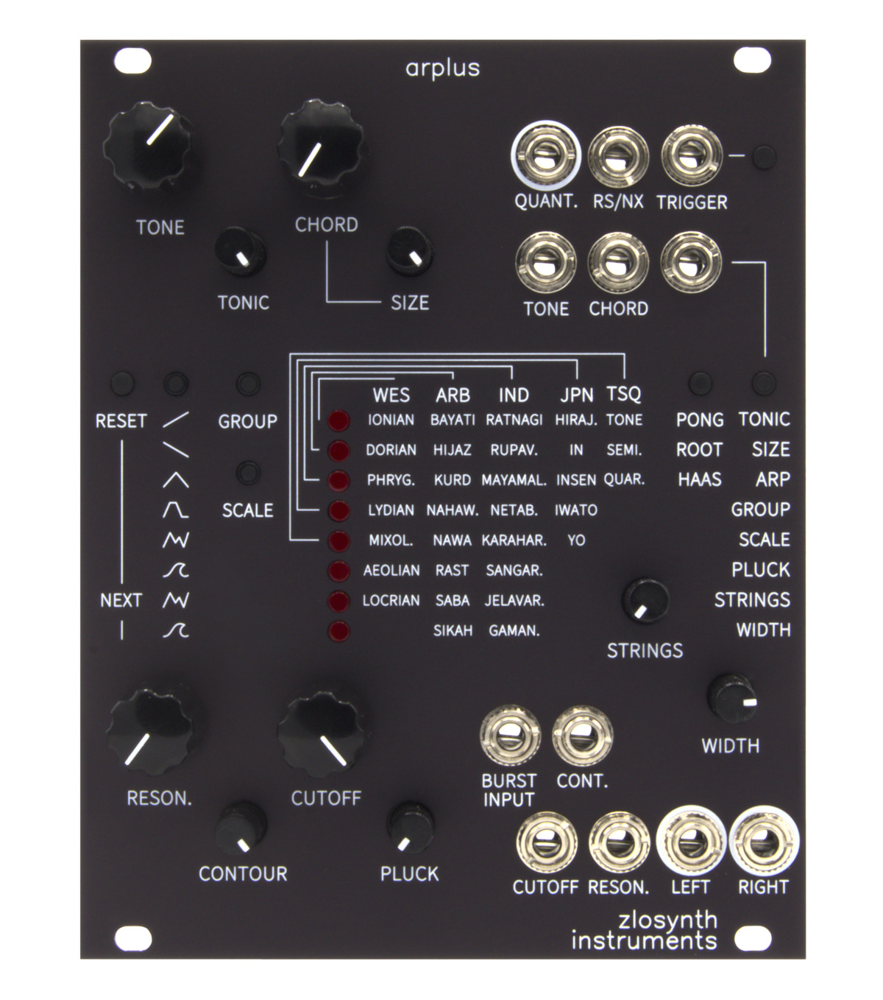

# Arplus

Quantizer, arpeggiator, and string synthesizer in a single module. 

   

* Karplus-Strong string synthesis with 6-voice polyphony
* External audio input for custom excitation sources
* 31 different scales and chords of up to 8 notes
* Configurable scales
* CV-controllable arpeggiator patterns
* Quantized 1V/oct output
* Three different stereo output modes
* Based around Electro-Smith's [Daisy Patch SM](https://www.electro-smith.com/daisy/patch-sm) platform
* Programmed in Rust

Find more details about the module, including a feature overview video and a
user manual, on its [website](https://zlosynth.com/arplus).

# License

Software of Kaseta is distributed under the terms of the General Public License
version 3. See [LICENSE-SOFTWARE](LICENSE-SOFTWARE) for details.

Schematics and PCB layout are distributed under the terms of Creative Commons
BY-SA. See [LICENSE-HARDWARE](LICENSE-HARDWARE) for details.

The manual is also distributed under the terms of Creative Commons BY-SA. See
[LICENSE-MANUAL](LICENSE-MANUAL) for details.

# Derivative work

This project is open-source. As long as you comply with the license, you're
free to study the code, copy it, modify it, build your own module, and even
sell it.

However, if you choose to sell your own build, please do not use the name
"Zlosynth" on the panel, and clearly state in the description that it is
a clone.

# Changelog

Read the [CHANGELOG.md](CHANGELOG.md) to learn about changes introduced in each
release.

# Versioning

See [VERSIONING.md](VERSIONING.md) to find detailed information about versioning
of the project and compatability between its software and hardware.

# Development

See [DEVELOPMENT.md](DEVELOPMENT.md) to find some basic commands to interact
with the project. To learn more, read the code. A good place to start would be
[firmware/src/main.rs](firmware/src/main.rs).
